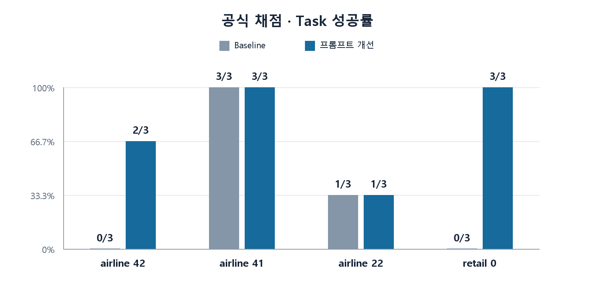

# agent-tool-use

## Overview

LLM 기반 Agent의 Tool Use를 이해하고, Agent를 구현·평가한 뒤 실패를 분석하고 개선을 적용·재평가하는 과정을 경험하는 학습 프로젝트입니다.

### Evaluation

- Benchmark: tau2-bench
- Domains:
  - mock
  - retail — 일부 task
  - airline — 일부 task

### LLM Environment

- Backend: llama.cpp
- Model: Gemma 4 12B (QAT Q4_0)

## Quick Start

### 1. 사전 준비

- Python 3.12 또는 3.13
- uv

아래 명령은 프로젝트 루트에서 실행합니다. `tau2-bench`가 없다면 github 저장소에서 다운받습니다.

```powershell
git clone https://github.com/sierra-research/tau2-bench.git ../tau2-bench
```

```text
projects/
├── agent-tool-use/
└── tau2-bench/
```

### 2. 설치 및 환경변수 설정

```powershell
uv sync
```

프로젝트 루트에 `.env` 파일을 만들고 공식 평가 데이터의 위치를 지정합니다. 상대 경로는 명령을 실행하는 프로젝트 루트 기준입니다.

```dotenv
TAU2_DATA_DIR=../tau2-bench/data

# 서버 인증이 필요한 경우에만 설정합니다.
# EVAL_AGENT_API_KEY=your-agent-api-key
# EVAL_USER_API_KEY=your-user-api-key
```

모델 ID와 서버 주소는 `.env`가 아닌 다음 단계의 `evaluation.toml`에서 설정합니다.

### 3. 평가 설정

설정 파일을 생성합니다.

```powershell
uv run python scripts/evaluate.py init
```

생성된 `evaluation.toml`에 평가할 task와 모델 서버 정보를 설정합니다. 아래는 `mock/create_task_1`을 한 번 실행하는 예시입니다.

```toml
[evaluation]
domain = "mock"
task_ids = ["create_task_1"]
seed = 42
num_trials = 1
max_concurrency = 1

[agent]
model = "your-model-id"
base_url = "http://localhost:8080/v1"
# api_key_env = "EVAL_AGENT_API_KEY"

[user]
model = "your-model-id"
base_url = "http://localhost:8080/v1"
# api_key_env = "EVAL_USER_API_KEY"
```

`model`은 서버가 제공하는 실제 모델 ID로, `base_url`은 서버 주소로 변경합니다. Agent와 User Simulator에 같은 모델과 서버를 사용해도 됩니다.

서버 인증이 필요하면 `.env`의 키 설정과 해당 역할의 `api_key_env` 주석을 해제합니다. `api_key_env`에는 실제 키가 아니라 키를 저장한 환경변수 이름을 지정합니다. 인증이 필요 없으면 생략합니다.

### 4. 실행 및 결과 확인

```powershell
uv run --env-file .env python scripts/evaluate.py run evaluation.toml
```

결과는 `artifacts/evaluations/` 아래 실행별 디렉터리에 저장됩니다.

- `results.json`: 대화, 도구 호출·결과, 공식 평가 결과
- `metadata.toml`: 실행 설정, Agent 프롬프트, 버전 정보

명령이 출력한 결과 경로를 사용해 공식 뷰어에서 확인합니다.

```powershell
uv run --env-file .env tau2 view --file "<results.json 경로>"
```

## Project Structure

```text
agent-tool-use/
├── agents/      # TaskAgent와 출력 전 검토·수정(reflection)
├── configs/     # 실험별 평가 설정
├── scripts/     # 평가 실행용 CLI
├── evals/       # 평가 실행, 추가 채점, 결과 게시
├── docs/        # 학습 노트와 실험 문서
├── artifacts/   # 실행 결과, 메타데이터, 분석 기록
└── tests/       # 구현 동작을 검증하는 테스트
```

`artifacts/`의 자료는 평가 실행 및 분석 과정에서 생성됩니다.

## Results

실험의 가설과 결과는 [프롬프트 개선](docs/experiments/001-prompt-improvement.md), [Reflection](docs/experiments/002-reflection.md)에 정리했습니다. [평가 원본과 판정 근거](artifacts/published/README.md)도 저장소에서 확인할 수 있습니다.

### 공식 채점

4개 task를 버전별로 각각 3회 실행한 결과입니다. 성공률은 공식 evaluator의 `reward = 1`인 실행 비율이며, 막대 위 숫자는 성공 횟수/전체 실행 횟수입니다. Reflection 실행은 포함하지 않았습니다.



### 추가 채점 (llm as a judge)

#### airline 42

Baseline과 프롬프트 개선 버전을 각각 3회 실행한 뒤, 저장된 실행 기록을 LLM judge로 채점한 결과입니다. 막대 안의 숫자는 판정별 실행 수이며, 해당 없음(N/A)은 통과·실패와 구분합니다.


[다른 task의 차트](docs/assets/charts/)도 확인할 수 있습니다.
