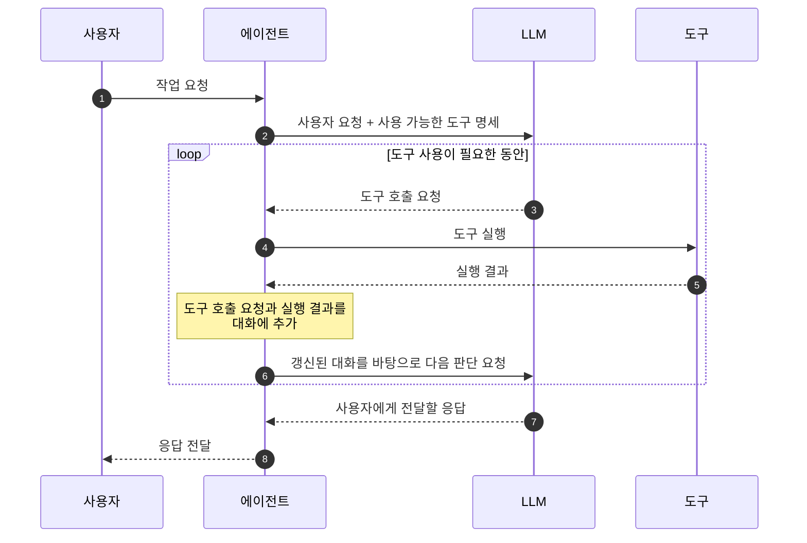

# Tool Use

## 정의

`Tool Use`는 **에이전트(Agent)**가 작업을 수행하는데 필요한 **도구(Tool)**를 판단하고 사용하는 능력입니다. 

## 작동 방식



- LLM은 어떤 도구를 호출할지 판단하여 도구 호출 요청을 생성합니다. 에이전트는 LLM에게 받은 요청을 분석하여 해당 도구를 실행하고, 실행 결과를 다시 LLM에게 전달하여 최종 응답을 생성하도록 합니다.

## 도구 명세 (Tool Definition)

### 역할

도구 명세(Tool Definition)는 LLM에게 **어떤 도구를 사용할 수 있고, 각 도구에 어떤 입력을 전달해야 하는지** 알려주는 설명입니다. 에이전트는 모델을 호출할 때 대화와 함께 도구 명세를 전달합니다. LLM은 사용자 요청과 도구 명세를 바탕으로 호출할 도구의 이름과 인자를 생성합니다.

예를 들어 “서울의 날씨를 알려줘”라는 요청을 받으면, 날씨 조회 도구의 설명을 보고 해당 도구를 선택하고 지역 인자에 “서울”을 넣은 호출 요청을 생성할 수 있습니다. 이때 도구의 구현 코드가 모델에 전달되는 것은 아니며, 실제 조회는 호출 요청을 받은 에이전트 측에서 수행합니다.

### 구성

함수를 도구로 제공할 때 사용하는 명세는 일반적으로 다음 정보를 포함합니다.

| 항목 | 설명 | 예시 |
| --- | --- | --- |
| 이름 | 호출할 도구를 식별하는 이름 | `get_weather` |
| 설명 | 도구가 하는 일과 사용 목적 | 지정한 지역의 현재 날씨 조회 |
| 입력 인자 | 인자의 이름, 자료형, 설명 | `location`: 조회할 지역을 나타내는 문자열 |
| 입력 조건 | 필수 인자와 허용 값 등의 제약 | `location`은 필수 |

입력 구조는 JSON Schema로 표현할 수 있습니다. 아래는 특정 API의 전체 요청 형식이 아닌, 도구 명세를 단순화한 예시입니다.

```json
{
  "name": "get_weather",
  "description": "지정한 지역의 현재 날씨를 조회합니다.",
  "parameters": {
    "type": "object",
    "properties": {
      "location": {
        "type": "string",
        "description": "날씨를 조회할 지역 이름"
      }
    },
    "required": ["location"]
  }
}
```

이 명세를 받은 모델은 `get_weather`라는 도구 이름과 `{"location": "서울"}` 같은 인자를 생성할 수 있습니다. 명세의 구체적인 형식과 지원하는 제약은 모델 API에 따라 달라집니다.

### 코드에서 도구 명세를 만드는 방법

도구 명세를 직접 작성할 수도 있지만, 프레임워크를 통해 Python 함수의 정보를 명세로 변환할 수도 있습니다. 다음은 데코레이터를 사용하는 방식을 보여주는 개념적인 예시입니다.

```python
@tool
def get_weather(location: str) -> str:
    """지정한 지역의 현재 날씨를 조회합니다.

    Args:
        location: 날씨를 조회할 지역 이름
    """
    # 실제 날씨 조회 코드를 구현합니다.
    ...
```

프레임워크는 함수 이름을 도구 이름으로, 타입 힌트를 입력 자료형으로, docstring을 도구와 인자의 설명으로 활용할 수 있습니다. 기본값이 없는 인자는 일반적으로 필수 입력으로 표현합니다.

```text
함수 이름·타입 힌트·docstring
→ 프레임워크가 도구 정보를 추출
→ 모델 API에 맞는 명세로 변환
→ LLM 호출 시 전달
```

`@tool`의 이름과 동작은 프레임워크마다 다릅니다. 데코레이터가 도구임을 표시하고, 실제 정보 추출이나 변환은 다른 코드에서 수행할 수도 있습니다. 또한 `Args:`는 Python 자체의 문법이 아니라 docstring 작성 관례이므로, 프레임워크가 해당 형식의 파싱을 지원해야 인자 설명으로 활용됩니다. 입력 구조를 Pydantic 모델 등으로 별도 정의하는 방식도 있습니다.
