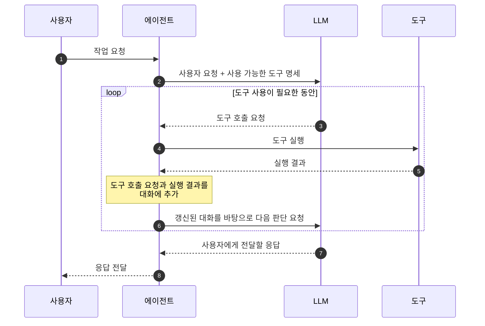

# Tool Use

## 정의

`Tool Use`는 **에이전트(Agent)**가 작업을 수행하는데 필요한 **도구(Tool)**를 판단하고 사용하는 능력입니다. 

## 작동 방식

- LLM은 어떤 도구를 호출할지 판단하여 도구 호출 요청을 생성합니다. 에이전트는 LLM에게 받은 요청을 분석하여 해당 도구를 실행하고, 실행 결과를 다시 LLM에게 전달하여 최종 응답을 생성하도록 합니다.