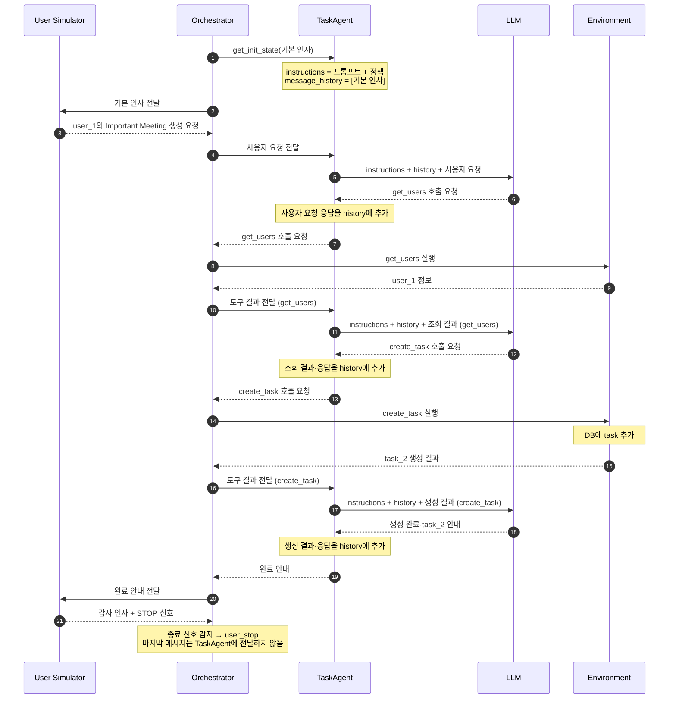

# tau2-bench의 에이전트 실행 흐름

## 다이어그램

## 구성 요소

### User Simulator

평가 중 실제 사람을 대신해 에이전트에게 작업을 요청하는 가상의 사용자다. task에는 이 사용자가 처한 상황과 요청할 내용이 정의되어 있다. User Simulator는 이를 바탕으로 LLM을 사용해 사용자 메시지를 생성한다.

### Orchestrator

사용자, 에이전트, 도구 사이에서 대화를 진행하는 주체다. 이들은 서로 직접 메시지를 주고받지 않고, Orchestrator가 응답을 받아 다음 대상에게 전달한다.

예를 들어 에이전트가 일반 답변을 반환하면 사용자에게 전달하고, 도구 호출을 요청하면 Environment에 실행을 맡긴 뒤 결과를 에이전트에게 돌려준다. 대화와 도구 실행 기록을 모으고, 종료 신호나 실행 제한에 따라 진행을 끝내는 것도 Orchestrator의 역할이다.

### TaskAgent

사용자의 요청을 해결해야 하는, 우리가 만든 평가 대상이다. 사용자 요청이나 도구 실행 결과를 받으면 프롬프트·정책·이전 대화와 함께 LLM에 전달한다. 이렇게 제공하는 정보가 LLM이 다음 행동을 결정하는 맥락이 된다.

TaskAgent는 LLM이 생성한 응답을 Orchestrator에 반환하고, 다음 응답 생성에 사용할 대화 맥락(`message_history`)을 갱신한다.

### LLM

TaskAgent가 다음 답변이나 도구 호출을 생성하기 위해 사용하는 언어 모델이다. 전달받은 대화와 사용 가능한 도구 정의를 바탕으로, 사용자에게 답할지 또는 어떤 도구를 어떤 인자로 호출할지를 결정한다.

예를 들어 `create_task`를 선택해도 모델 자체가 DB를 수정하는 것은 아니다. 모델은 도구 이름과 인자가 담긴 호출 요청을 생성한다.

### Environment

에이전트가 작업할 대상인 도구와 DB를 제공하는 평가 환경이다. 이번 mock domain에서는 사용자와 task 데이터를 가지고 있으며, `get_users`나 `create_task` 같은 도구를 통해 이 데이터를 조회하거나 변경할 수 있다.

Orchestrator가 도구 호출 요청을 전달하면 Environment가 해당 도구를 실행하고 결과를 반환한다. 이번 실행에서 `task_2`가 실제로 생성되는 곳도 이 mock DB다. 에이전트가 말로 “생성했다”고 안내하는 것과 도구 실행으로 데이터가 변경되는 것은 별개의 과정이다.
